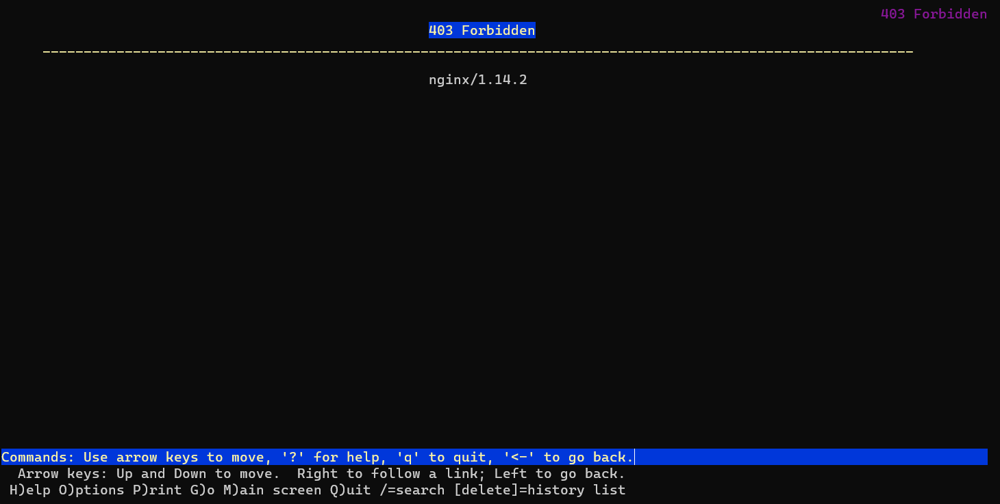

# Praktikum Jaringan Komputer 2023

**Kelompok IT08**

Nama Anggota Kelompok | NRP
------------------- | --------------		
Aqil Sulthan Yuki Maye | 5027211007
Adimas Defatra Bimasena | 5027211040

 Kelompok | Prefix IP 
----------|-----------
 IT08      | 192.237   

## Modul 3

## Daftar Soal :
- [Soal 0](#soal-0)
- [Soal 1](#soal-1)
- [Soal 2](#soal-2)
- [Soal 3](#soal-3)
- [Soal 4](#soal-4)
- [Soal 5](#soal-5)
- [Soal 6](#soal-6)
- [Soal 7](#soal-7)
- [Soal 8](#soal-8)
- [Soal 9](#soal-9)
- [Soal 10](#soal-10)
- [Soal 11](#soal-11)
- [Soal 12](#soal-12)
- [Soal 13](#soal-13)
- [Soal 14](#soal-14)
- [Soal 15](#soal-15)
- [Soal 16](#soal-16)
- [Soal 17](#soal-17)
- [Soal 18](#soal-18)
- [Soal 19](#soal-19)
- [Soal 20](#soal-20)

---

### Topologi


### [Konfigurasi](#konfigurasi)
```
Aura (DHCP Relay)

auto eth0
iface eth0 inet dhcp
up iptables -t nat -A POSTROUTING -o eth0 -j MASQUERADE -s 192.237.0.0/16

auto eth1
iface eth1 inet static
	address 192.237.1.1
	netmask 255.255.255.0

auto eth2
iface eth2 inet static
	address 192.237.2.1
	netmask 255.255.255.0

auto eth3
iface eth3 inet static
	address 192.237.3.1
	netmask 255.255.255.0

auto eth4
iface eth4 inet static
	address 192.237.4.1
	netmask 255.255.255.0

Himmel (DHCP Server)
auto eth0
iface eth0 inet static
	address 192.237.1.2
	netmask 255.255.255.0
	gateway 192.237.1.1

Heiter (DNS Server)
auto eth0
iface eth0 inet static
	address 192.237.1.3
	netmask 255.255.255.0
	gateway 192.237.1.1

Denken (Database Server)
auto eth0
iface eth0 inet static
	address 192.237.2.2
	netmask 255.255.255.0
	gateway 192.237.2.1

Eisen (Load Balancer)
auto eth0
iface eth0 inet static
	address 192.237.2.3
	netmask 255.255.255.0
	gateway 192.237.2.1

Frieren (Laravel Worker)
auto eth0
iface eth0 inet static
	address 192.237.4.4
	netmask 255.255.255.0
	gateway 192.237.4.1

# hwaddress ether 

Flamme (Laravel Worker)
auto eth0
iface eth0 inet static
	address 192.237.4.3
	netmask 255.255.255.0
	gateway 192.237.4.1

# hwaddress ether 

Fern (Laravel Worker)
auto eth0
iface eth0 inet static
	address 192.237.4.2
	netmask 255.255.255.0
	gateway 192.237.4.1

# hwaddress ether 

Lawine (PHP Worker)
auto eth0
iface eth0 inet static
	address 192.237.3.4
	netmask 255.255.255.0
	gateway 192.237.3.1

Linie (PHP Worker)
auto eth0
iface eth0 inet static
	address 192.237.3.3
	netmask 255.255.255.0
	gateway 192.237.3.1

Lugner (PHP Worker)
auto eth0
iface eth0 inet static
	address 192.237.3.2
	netmask 255.255.255.0
	gateway 192.237.3.1

Revolte, Richter, Sein, dan Stark (Client)
auto eth0
iface eth0 inet dhcp
```

Install modul berikut pada masing-masing node
- Seluruh client
```
echo 'nameserver 192.237.1.3' > /etc/resolv.conf
apt update
apt install lynx -y
apt install htop -y
apt install apache2-utils -y
apt-get install jq -y
```
- Aura
```
apt-get update
apt install isc-dhcp-relay -y
```
- Himmel
```
echo 'nameserver 192.237.1.3' > /etc/resolv.conf
apt-get update
apt install isc-dhcp-server -y
```
- Heiter
```
echo 'nameserver 192.168.122.1' > /etc/resolv.conf
apt-get update
apt-get install bind9 -y  
```
- Denken
```
echo 'nameserver 192.237.1.3' > /etc/resolv.conf
apt-get update
apt-get install mariadb-server -y
service mysql start
```
- Eisen
```
echo 'nameserver 192.237.1.2' > /etc/resolv.conf
apt-get update
apt-get install lynx -y
apt-get install apache2-utils -y
apt-get install nginx -y
```
- PHP Worker
```
echo 'nameserver 192.237.1.3' > /etc/resolv.conf
apt-get update
apt-get install nginx -y
apt-get install wget -y
apt-get install unzip -y
apt-get install lynx -y
apt-get install htop -y
apt-get install apache2-utils -y
apt-get install php7.3-fpm php7.3-common php7.3-mysql php7.3-gmp php7.3-curl php7.3-intl php7.3-mbstring php7.3-xmlrpc php7.3-gd php7.3-xml php7.3-cli php7.3-zip -y

service nginx start
service php7.3-fpm start
```
- Laravel Worker
```
echo 'nameserver 192.237.1.3 ' > /etc/resolv.conf
apt-get update
apt-get install lynx -y
apt-get install mariadb-client -y
apt-get install php8.0-mbstring php8.0-xml php8.0-cli   php8.0-common php8.0-intl php8.0-opcache php8.0-readline php8.0-mysql php8.0-fpm php8.0-curl unzip wget -y
apt-get install -y lsb-release ca-certificates apt-transport-https software-properties-common gnupg2
curl -sSLo /usr/share/keyrings/deb.sury.org-php.gpg https://packages.sury.org/php/apt.gpg
sh -c 'echo "deb [signed-by=/usr/share/keyrings/deb.sury.org-php.gpg] https://packages.sury.org/php/ $(lsb_release -sc) main" > /etc/apt/sources.list.d/php.list'

apt-get update
apt-get install php8.0-mbstring php8.0-xml php8.0-cli php8.0-common php8.0-intl php8.0-opcache php8.0-readline php8.0-mysql php8.0-fpm php8.0-curl unzip wget -y
php --version
apt-get install nginx -y

service nginx start
service php8.0-fpm start

wget https://getcomposer.org/download/2.0.13/composer.phar
chmod +x composer.phar
mv composer.phar /usr/bin/composer
composer -V

apt-get install git -y
```

### Soal 0
Setelah mengalahkan Demon King, perjalanan berlanjut. Kali ini, kalian diminta untuk melakukan register domain berupa riegel.canyon.yyy.com untuk worker PHP dan granz.channel.yyy.com untuk worker Laravel mengarah pada worker yang memiliki IP [prefix IP].x.1.
- Penjelasan:
Melakukan konfigurasi domain di `/etc/bind/named.conf.local` pada node Heiter
```
zone "riegel.canyon.it08.com" {
        type master;
        file "/etc/bind/jarkom/riegel.canyon.it08.com";
};

zone "granz.channel.it08.com" {
        type master;
        file "/etc/bind/jarkom/granz.channel.it08.com";
};
```

---
### Soal 1
Lakukan konfigurasi sesuai dengan peta yang sudah diberikan. 

Kemudian, karena masih banyak spell yang harus dikumpulkan, bantulah para petualang untuk memenuhi kriteria berikut :

Semua CLIENT harus menggunakan konfigurasi dari DHCP Server.
- Penjelasan:
Menambahkan konfigurasi berikut ke `/etc/bind/sites/riegel.canyon.it08.com` dan `/etc/bind/sites/granz.channel.it08.com` pada node Heiter
```
echo '
;
; BIND data file for local loopback interface
;
$TTL    604800
@       IN      SOA     riegel.canyon.it08.com. root.riegel.canyon.it08.com. (
                        2023101001      ; Serial
                         604800         ; Refresh
                          86400         ; Retry
                        2419200         ; Expire
                         604800 )       ; Negative Cache TTL
;
@       IN      NS      riegel.canyon.it08.com.
@       IN      A       192.237.2.3     ; IP Eisen
www     IN      CNAME   riegel.canyon.it08.com.' > /etc/bind/jarkom/riegel.canyon.it08.com

rm /etc/bind/jarkom/granz.channel.it08.com
cp /etc/bind/db.local /etc/bind/jarkom/granz.channel.it08.com

echo '
;
; BIND data file for local loopback interface
;
$TTL    604800
@       IN      SOA     granz.channel.it08.com. root.granz.channel.it08.com. (
                        2023101001      ; Serial
                         604800         ; Refresh
                          86400         ; Retry
                        2419200         ; Expire
                         604800 )       ; Negative Cache TTL
;
@       IN      NS      granz.channel.it08.com.
@       IN      A       192.237.2.3   ; IP Eisen
www     IN      CNAME   granz.channel.it08.com.' > /etc/bind/jarkom/granz.channel.it08.com
```
Kemudian menambahkan konfigurasi berikut ke `/etc/bind/named.conf.options`
```
echo 'options {
      directory "/var/cache/bind";

      forwarders {
              192.168.122.1;
      };

      // dnssec-validation auto;
      allow-query{any;};
      auth-nxdomain no;    # conform to RFC1035
      listen-on-v6 { any; };
}; ' >/etc/bind/named.conf.options
```
Lakukan ping di client


---
### Soal 2
Client yang melalui Switch3 mendapatkan range IP dari [prefix IP].3.16 - [prefix IP].3.32 dan [prefix IP].3.64 - [prefix IP].3.80
- Penjelasan:
Menambahkan konfigurasi berikut di `/etc/dhcp/dhcpd.conf` pada node Himmel
```
# eth3
subnet 192.237.3.0 netmask 255.255.255.0 {
    range 192.237.3.16 192.237.3.32;
    range 192.237.3.64 192.237.3.80;
    option routers 192.237.3.1;
}
```

---
### Soal 3
Client yang melalui Switch4 mendapatkan range IP dari [prefix IP].4.12 - [prefix IP].4.20 dan [prefix IP].4.160 - [prefix IP].4.168
- Penjelasan:
Menambahkan konfigurasi berikut di `/etc/dhcp/dhcpd.conf` pada node Himmel
```
# eth4
subnet 192.237.4.0 netmask 255.255.255.0 {
    range 192.237.4.12 192.237.4.20;
    range 192.237.4.160 192.237.4.168;
    option routers 192.237.4.1;
}
```

---
### Soal 4 
Client mendapatkan DNS dari Heiter dan dapat terhubung dengan internet melalui DNS tersebut
- Penjelasan:
Agar mendapatkan DNS yang telah dibuat sebelumnya, tambahkan konfigurasi `option broadcast-address` dan `option domain-name-server` pada masing-masing konfigurasi subnet `/etc/dhcp/dhcpd.conf` pada node Himmel
```
# eth3
subnet 192.237.3.0 netmask 255.255.255.0 {
    range 192.237.3.16 192.237.3.32;
    range 192.237.3.64 192.237.3.80;
    option routers 192.237.3.1;
    option broadcast-address 192.237.3.255;
    option domain-name-servers 192.237.1.3;
}

# eth4
subnet 192.237.4.0 netmask 255.255.255.0 {
    range 192.237.4.12 192.237.4.20;
    range 192.237.4.160 192.237.4.168;
    option routers 192.237.4.1;
    option broadcast-address 192.237.4.255;
    option domain-name-servers 192.237.1.3;
}
```
Pastikan DHCP Relay telah dilakukan konfigurasi DHCP relay forward dan masing-masing interfacesnya di `/etc/default/isc-dhcp-relay` seperti berikut
```
echo '
SERVERS="192.237.1.2"
INTERFACES="eth1 eth2 eth3 eth4"
OPTIONS=' > /etc/default/isc-dhcp-relay
```
Tambahkan pula konfigurasi berikut di `/etc/sysctl.conf`
```
echo 'net.ipv4.ip_forward=1' > /etc/sysctl.conf
```
Restart node client untuk melihat hasilnya


---
### Soal 5
Lama waktu DHCP server meminjamkan alamat IP kepada Client yang melalui Switch3 selama 3 menit sedangkan pada client yang melalui Switch4 selama 12 menit. Dengan waktu maksimal dialokasikan untuk peminjaman alamat IP selama 96 menit 

Berjalannya waktu, petualang diminta untuk melakukan deployment.
- Penjelasan:
Menambahkan fungsi `default-lease-time` dan `max-lease-team` pada masing- masing subnet dalam satuan detik, dengan Switch3 membutuhkan waktu 180 s (3 Menit) dan Switch4 membutuhkan waktu 720 s (12 Menit) dengan  max-lease-time nya adalah 5760 s (96 menit).
```
# eth3
subnet 192.237.3.0 netmask 255.255.255.0 {
    range 192.237.3.16 192.237.3.32;
    range 192.237.3.64 192.237.3.80;
    option routers 192.237.3.1;
    option broadcast-address 192.237.3.255;
    option domain-name-servers 192.237.1.3;
    default-lease-time 180;
    max-lease-time 5760;
}

# eth4
subnet 192.237.4.0 netmask 255.255.255.0 {
    range 192.237.4.12 192.237.4.20;
    range 192.237.4.160 192.237.4.168;
    option routers 192.237.4.1;
    option broadcast-address 192.237.4.255;
    option domain-name-servers 192.237.1.3;
    default-lease-time 720;
    max-lease-time 5760;
}
```


---
### Soal 6
Pada masing-masing worker PHP, lakukan konfigurasi virtual host untuk website berikut dengan menggunakan php 7.3.
- Penjelasan:
Melakukan konfigurasi pada masing-masing PHP Worker seperti yang telah dijelaskan sebelumnya pada [konfigurasi](#konfigurasi), kemudian install resources yang dibutuhkan dari soal pada masing-masing worker
```
wget --no-check-certificate -O '/var/www/granz.channel.it08.com.zip' 'https://drive.google.com/u/0/uc?id=1ViSkRq7SmwZgdK64eRbr5Fm1EGCTPrU1&export=download'
unzip -o /var/www/granz.channel.it08.com.zip -d /var/www/
rm /var/www/granz.channel.it08.com.zip
mv /var/www/modul-3 /var/www/granz.channel.it08.com
```
Melakukan konfigurasi berikut pada `/etc/nginx/sites-available/lb_php`
```
echo ' 
server {
    listen 80;
    server_name granz.channel.it08.com www.granz.channel.it08.com;

    root /var/www/html;

    index index.html index.htm index.nginx-debian.html;

    server_name _;

    location / {
        proxy_pass http://worker;
    }
} ' > /etc/nginx/sites-available/lb_php
```
Restart nginx dan jalankan hasilnya dengan cara `lynx localhost`


---
### Soal 7
Kepala suku dari Bredt Region memberikan resource server sebagai berikut:
a. Lawine, 4GB, 2vCPU, dan 80 GB SSD.
b. Linie, 2GB, 2vCPU, dan 50 GB SSD.
c. Lugner 1GB, 1vCPU, dan 25 GB SSD.
aturlah agar Eisen dapat bekerja dengan maksimal, lalu lakukan testing dengan 1000 request dan 100 request/second.
- Penjelasan:
Melakukan konfigurasi pada Load Balancer seperti yang telah dijelaskan sebelumnya pada [konfigurasi](#konfigurasi).
Setelah itu, tambahkan konfigurasi berikut di `/etc/bind/sites/granz.channel.it08.com` pada node Heiter
```
echo '
;
; BIND data file for local loopback interface
;
$TTL    604800
@       IN      SOA     riegel.canyon.it08.com. root.riegel.canyon.it08.com. (
                        2023101001      ; Serial
                         604800         ; Refresh
                          86400         ; Retry
                        2419200         ; Expire
                         604800 )       ; Negative Cache TTL
;
@       IN      NS      riegel.canyon.it08.com.
@       IN      A       192.237.2.3     ; IP Eisen
www     IN      CNAME   riegel.canyon.it08.com.' > /etc/bind/jarkom/riegel.canyon.it08.com

rm /etc/bind/jarkom/granz.channel.it08.com
cp /etc/bind/db.local /etc/bind/jarkom/granz.channel.it08.com

echo '
;
; BIND data file for local loopback interface
;
$TTL    604800
@       IN      SOA     granz.channel.it08.com. root.granz.channel.it08.com. (
                        2023101001      ; Serial
                         604800         ; Refresh
                          86400         ; Retry
                        2419200         ; Expire
                         604800 )       ; Negative Cache TTL
;
@       IN      NS      granz.channel.it08.com.
@       IN      A       192.237.2.3   ; IP Eisen
www     IN      CNAME   granz.channel.it08.com.' > /etc/bind/jarkom/granz.channel.it08.com

rm /etc/bind/jarkom/1.237.192.in-addr.arpa
cp /etc/bind/db.local /etc/bind/jarkom/1.237.192.in-addr.arpa
```
Lakukan konfigurasi nginx pula terhadap node Heiter
```
server {
    listen 80;
    server_name granz.channel.it08.com www.granz.channel.it08.com;

    root /var/www/html;
    index index.html index.htm index.nginx-debian.html;

    location / {
        proxy_pass http://worker;
    }
}' > /etc/nginx/sites-available/lb_php

ln -s /etc/nginx/sites-available/lb_php /etc/nginx/sites-enabled/
rm /etc/nginx/sites-enabled/default

service nginx restart
```
Lalu uji benchmarking pada client dengan query seperti berikut
```
ab -n 1000 -c 100 http://www.granz.channel.it08.com/ 
```
maka akan didapat hasil request persecondnya berdasarkan persentase masing-masing


---
### Soal 8
Karena diminta untuk menuliskan grimoire, buatlah analisis hasil testing dengan 200 request dan 10 request/second masing-masing algoritma Load Balancer dengan ketentuan sebagai berikut:
> - a. Nama Algoritma Load Balancer
> - b. Report hasil testing pada Apache Benchmark
> - c. Grafik request per second untuk masing masing algoritma. 
> - d. Analisis
- Penjelasan:
Jalankan perintah berikut pada node client, serta ubah upstream berdasarkan masing-masing algoritma
```
ab -n 200 -c 10 http://www.granz.channel.it08.com/ 
``` 
Hasil:
> Round Robin


> Least Connection


> IP Hash


> Generic Hash


Untuk laporan lebih detailnya dapat dilihat pada laporan grimoire yang sudah tertera.

---
### Soal 9
Dengan menggunakan algoritma Round Robin, lakukan testing dengan menggunakan 3 worker, 2 worker, dan 1 worker sebanyak 100 request dengan 10 request/second, kemudian tambahkan grafiknya pada grimoire.
- Penjelasan:
Jalankan perintah berikut pada node client dan jangan lupa testing jumlah worker ke 1, 2, dan 3 worker pada node Eisen
```
ab -n 100 -c 10 http://www.granz.channel.it08.com/ 
``` 
Hasil:
> 1 Worker


> 2 Worker


> 3 Worker


Untuk laporan lebih detailnya dapat dilihat pada laporan grimoire yang sudah tertera.

---
### Soal 10
Selanjutnya coba tambahkan konfigurasi autentikasi di LB dengan dengan kombinasi username: “netics” dan password: “ajkyyy”, dengan yyy merupakan kode kelompok. Terakhir simpan file “htpasswd” nya di /etc/nginx/rahasisakita/
- Penjelasan:
Melakukan konfigurasi username dan password dengan htpasswd seperti berikut
```
mkdir /etc/nginx/rahasisakita
htpasswd -c /etc/nginx/rahasisakita/htpasswd netics
## lalu masukkan passwordnya ajkit08
```
Lalu menambahkan konfigurasi berikut di `/etc/nginx/sites-available/lb_php` pada node Eisen
```
location / {
        allow 192.237.3.69;
        allow 192.237.3.70;
        allow 192.237.3.23; # test ip allow
        allow 192.237.4.167;
        allow 192.237.4.168;
        deny all;
        auth_basic "Restricted Content";
        auth_basic_user_file /etc/nginx/rahasisakita/htpasswd;
        proxy_pass http://worker;
    }
```
Jalankan perintah `lynx http://www.granz.channel.it08.com/`, dan akses akan dibatasi bagi pengguna yang memiliki username dan password yang telah didaftarkan pada htpasswd


---
### Soal 11
Lalu buat untuk setiap request yang mengandung /its akan di proxy passing menuju halaman https://www.its.ac.id.
- Penjelasan:
Tambahkan konfigurasi berikut di `/etc/nginx/sites-available/lb_php` pada node Eisen dengan proxy_pass mengarah ke alamat website ITS (its.ac.id)
```
location /its {
        proxy_pass https://www.its.ac.id;
        proxy_set_header Host www.its.ac.id;
        proxy_set_header X-Real-IP $remote_addr;
        proxy_set_header X-Forwarded-For $proxy_add_x_forwarded_for;
        proxy_set_header X-Forwarded-Proto $scheme;
    }
```
Jalankan perintah `lynx http://www.granz.channel.it08.com/its`, dan link tersebut akan mengarah kepada website ITS


---
### Soal 12
Selanjutnya LB ini hanya boleh diakses oleh client dengan IP [Prefix IP.3.69], [Prefix IP.3.70], [Prefix IP.4.167], dan [Prefix IP.4.168].

Karena para petualang kehabisan uang, mereka kembali bekerja untuk mengatur granz.channel.yyy.com.
- Penjelasan:
Tambahkan konfigurasi berikut di `/etc/nginx/sites-available/lb_php` pada node Eisen dengan akses IP yang diperbolehkan
```
location / {
        allow 192.237.3.69;
        allow 192.237.3.70;
        allow 192.237.4.167;
        allow 192.237.4.168;
        deny all;
        proxy_pass http://worker;
    }
```
Maka website hanya akan bisa diakses oleh client dengan IP `192.237.3.69`, `192.237.3.70`, `192.237.4.16`7, dan `192.237.4.168`.
Jika website diakses oleh client dengan IP yang tidak diizinkan (deny), maka tampilannya akan seperti berikut


Agar website bisa diakses, maka kita bisa mengizinkannya dengan melakukan konfigurasi seperti berikut
```
location / {
        allow 192.237.3.69;
        allow 192.237.3.70;
        allow 192.237.3.23; # test ip allow
        allow 192.237.4.167;
        allow 192.237.4.168;
        deny all;
        proxy_pass http://worker;
    }
```
Serta juga dapat melakukan konfigurasi fixed address pada node Himmel

Maka jika diakses oleh client dengan IP yang diizinkan (allow), maka tampilannya akan seperti berikut


---
### Soal 13 
Semua data yang diperlukan, diatur pada Denken dan harus dapat diakses oleh Frieren, Flamme, dan Fern.
- Penjelasan:
Melakukan konfigurasi database server sesuai [konfigurasi](#konfigurasi) pada node Denken dan menambahkan konfigurasi berikut pada `/etc/mysql/mariadb.conf.d/50-server.cnf`
```
...
echo '# This group is read both by the client and the server
# use it for options that affect everything
[client-server]
...
# Import all .cnf files from configuration directory
!includedir /etc/mysql/conf.d/
!includedir /etc/mysql/mariadb.conf.d/
...
# Options affecting the MySQL server (mysqld)
[mysqld]
skip-networking=0
skip-bind-address
...
# Instead of skip-networking the default is now to listen only on
# localhost which is more compatible and is not less secure.
bind-address            = 0.0.0.0 # perlu diingat untuk mengganti bind addressnya menjadi 0.0.0.0
...
' > /etc/mysql/mariadb.conf.d/50-server.cnf
```
Lakukan restart pada MySQL dan jalankan perintah berikut
```
mysql -u root -p
```
Masukkan username root dan passwordnya, lalu jalankan perintah berikut secara berurutan
```
CREATE USER 'kelompokit08'@'%' IDENTIFIED BY 'passwordit08';
CREATE USER 'kelompokit08'@'localhost' IDENTIFIED BY 'passwordit08';
CREATE DATABASE dbkelompokit08;
GRANT ALL PRIVILEGES ON *.* TO 'kelompokit08'@'%';
GRANT ALL PRIVILEGES ON *.* TO 'kelompokit08'@'localhost';
FLUSH PRIVILEGES;
```

Untuk cek apakah database dapat berjalan dengan semestinya di laravel worker, jalankan command berikut
```
mariadb --host=192.237.2.2 --port=3306 --user=kelompokit08 --password=passwordit08 dbkelompokit08 -e "SHOW DATABASES;"
```
Jika database `dbbkelompokit08` berhasil diakses, maka tampilannya akan seperti berikut


---
### Soal 14 
Frieren, Flamme, dan Fern memiliki Granz Channel sesuai dengan quest guide berikut. Jangan lupa melakukan instalasi PHP8.0 dan Composer

Granz Channel memiliki beberapa endpoint yang harus ditesting sebanyak 100 request dengan 10 request/second. Tambahkan response dan hasil testing pada grimoire.
- Penjelasan:
Melakukan konfigurasi pada masing-masing Laravel Worker seperti yang telah dijelaskan sebelumnya pada [konfigurasi](#konfigurasi), kemudian install resources yang dibutuhkan dari soal pada masing-masing worker
```
git clone https://github.com/martuafernando/laravel-praktikum-jarkom.git
mv laravel-praktikum-jarkom /var/www/laravel-praktikum-jarkom

cd /var/www/laravel-praktikum-jarkom
composer update
composer install

mv .env.example .env
```
Setelah itu, lakukan konfigurasi berikut ke `/var/www/laravel-praktikum-jarkom/.env` pada masing-masing worker
```
echo '
APP_NAME=Laravel
APP_ENV=local
APP_KEY=
APP_DEBUG=true
APP_URL=http://localhost

LOG_CHANNEL=stack
LOG_DEPRECATIONS_CHANNEL=null
LOG_LEVEL=debug

DB_CONNECTION=mysql
DB_HOST=192.237.2.2
DB_PORT=3306
DB_DATABASE=dbkelompokit17
DB_USERNAME=kelompokit17
DB_PASSWORD=passwordit17

BROADCAST_DRIVER=log
CACHE_DRIVER=file
FILESYSTEM_DISK=local
QUEUE_CONNECTION=sync
SESSION_DRIVER=file
SESSION_LIFETIME=120

MEMCACHED_HOST=127.0.0.1

REDIS_HOST=127.0.0.1
REDIS_PASSWORD=null
REDIS_PORT=6379

MAIL_MAILER=smtp
MAIL_HOST=mailpit
MAIL_PORT=1025
MAIL_USERNAME=null
MAIL_PASSWORD=null
MAIL_ENCRYPTION=null
MAIL_FROM_ADDRESS="hello@example.com"
MAIL_FROM_NAME="${APP_NAME}"

AWS_ACCESS_KEY_ID=
AWS_SECRET_ACCESS_KEY=
AWS_DEFAULT_REGION=us-east-1
AWS_BUCKET=
AWS_USE_PATH_STYLE_ENDPOINT=false

PUSHER_APP_ID=
PUSHER_APP_KEY=
PUSHER_APP_SECRET=
PUSHER_HOST=
PUSHER_PORT=443
PUSHER_SCHEME=https
PUSHER_APP_CLUSTER=mt1

VITE_PUSHER_APP_KEY="${PUSHER_APP_KEY}"
VITE_PUSHER_HOST="${PUSHER_HOST}"
VITE_PUSHER_PORT="${PUSHER_PORT}"
VITE_PUSHER_SCHEME="${PUSHER_SCHEME}"
VITE_PUSHER_APP_CLUSTER="${PUSHER_APP_CLUSTER}"' > /var/www/laravel-praktikum-jarkom/.env

php artisan migrate:fresh
php artisan db:seed --class=AiringsTableSeeder
php artisan key:generate
php artisan jwt:secret
php artisan storage:link
```
Serta melakukan konfigurasi nginx berdasarkan tiap port dengan konfigurasi seperti berikut
```
192.237.4.2:8001; # Fern 
192.237.4.3:8002; # Flamme
192.237.4.4:8003; # Frieren
```
Serta mennambahkan konfigurasi nginx berikut untuk masing-masing worker berdasarkan port yang telah ditentukan sebelumnya
```
echo '
server {

    listen 8001;

    root /var/www/laravel-praktikum-jarkom/public;

    index index.php index.html index.htm;
    server_name _;

    location / {
            try_files $uri $uri/ /index.php?$query_string;
    }

    # pass PHP scripts to FastCGI server
    location ~ \.php$ {
    include snippets/fastcgi-php.conf;
    fastcgi_pass unix:/var/run/php/php8.0-fpm.sock;
    }

location ~ /\.ht {
            deny all;
    }

    error_log /var/log/nginx/jarkom_error.log;
    access_log /var/log/nginx/jarkom_access.log;
}' > /etc/nginx/sites-available/laravel-worker

ln -s /etc/nginx/sites-available/laravel-worker /etc/nginx/sites-enabled/

chown -R www-data.www-data /var/www/laravel-praktikum-jarkom/

service nginx restart
service php8.0-fpm start
```
Akses website dengan `lynx localhost:[8001/8002/8003]`


---
### Soal 15
POST /auth/register
- Penjelasan:


---
### Soal 16 
POST /auth/login
- Penjelasan:


---
### Soal 17
GET /me
- Penjelasan:


---
### Soal 18
Untuk memastikan ketiganya bekerja sama secara adil untuk mengatur Granz Channel maka implementasikan Proxy Bind pada Eisen untuk mengaitkan IP dari Frieren, Flamme, dan Fern.
- Penjelasan:


---
### Soal 19
Untuk meningkatkan performa dari Worker, coba implementasikan PHP-FPM pada Frieren, Flamme, dan Fern. Untuk testing kinerja naikkan 
> -  pm.max_children
> - pm.start_servers
> - pm.min_spare_servers
> - pm.max_spare_servers

sebanyak tiga percobaan dan lakukan testing sebanyak 100 request dengan 10 request/second kemudian berikan hasil analisisnya pada Grimoire.
- Penjelasan:


---
### Soal 20
Nampaknya hanya menggunakan PHP-FPM tidak cukup untuk meningkatkan performa dari worker maka implementasikan Least-Conn pada Eisen. Untuk testing kinerja dari worker tersebut dilakukan sebanyak 100 request dengan 10 request/second.
- Penjelasan:
